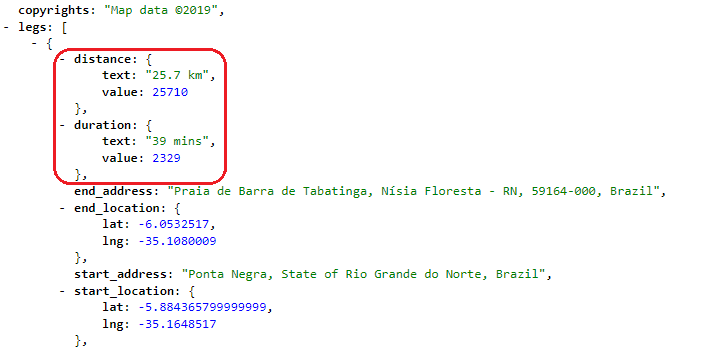

# TransferApp

  

O TransferApp é um aplicativo android construído para traçar rotas entre dois pontos, origem e destino, e calcular o preço da viagem, que depende diretamente da distância entre os dois pontos e o tempo de deslocamento. Esse aplicativo foi construído durante uma aula de Desenvolvimento para Android II promovido pela Pós Graduação em Dispositivos Móveis na Universidade Potiguar.

## Funcionamento

### Traçando rotas

Ao executar a aplicação, o usuário é apresentado à tela principal do TransferApp. Nela é possível fornecer um ponto de origem e um ponto de destino e, apertando o botão traçar rota, a aplicação fornecerá toda a rota entre os dois pontos, bem como a distância a ser percorrida e o tempo de viagem. 

  

### Taxas

#### Definindo taxas

Ao apertar o botão <b>Taxas</b>, o usuário poderá definir os valores de cobrança por distância percorrida e pelo tempo de deslocamento, sendo essa taxa cobrada por quilômetro e por minuto. Por padrão, o aplicativo adota uma taxa de R$0,80 por quilômetro e R$0,20 por minuto.

  

#### Aplicando taxas

Após ter traçado uma rota, o usuário será capaz de calcular o preço da viagem clicando no botão <b>Calcular</b>. No cálculo serão considerados os valores de distância entre os dois pontos, tempo de deslocamento e as taxas mencionadas no tópico anterior. O resultado do cálculo é mostrado a direita do botão calcular. A fórmula utilizada para chegar ao resultado é a seguinte: 

 <MATH>Valor = <b>dKm</b>*<b>tKm</b> + <b>dM</b>*<b>tM</b></MATH> 

  em que:

<ul>
  <li> <b>dKm</b> é a distância em quilômetros; </li>
  <li> <b>tKm</b> é a taxa cobrada por quilômetro; </li>
  <li> <b>dM</b> é a duração da viagem, em minutos; </li>
  <li> <b>tM</b> é a taxa cobrada por minuto. </li>
</ul>

  

### Discrepância entre valores

O usuário pode perceber uma diferença entre o valor apresentado pelo aplicativo e o valor que se pode chegar ao aplicar a fórmula apresentada no tópico anterior, utilizando os dados de distância e tempo fornecidas pela própria aplicação. Isso ocorre pois os valores de tempo e distância que são apresentados ao usuário são arredondados, enquanto os valores que são utilizados nos cálculos interno são os exatos disponibilizados pela Google Maps.

Abaixo é mostrada uma imagem do arquivo JSON retornado após a requisição de rota, no qual é possivel observar que <i>distance</i> e <i>duration</i> possuem dois atributos, <i>text</i> e <i>value</i>. Nos caso da <i>distance</i>, o atributo <i>text</i> representa o valor arredondado da distância e o atributo <i>value</i> representa o valor exato em metros. Já no <i>duration</i>, <i>text</i> representa o valor arredondado de tempo e <i>value</i> representa o valor exato em segundos.

  

